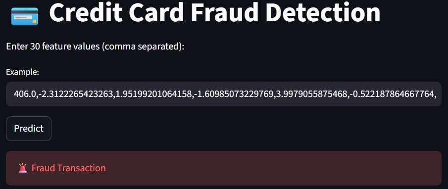
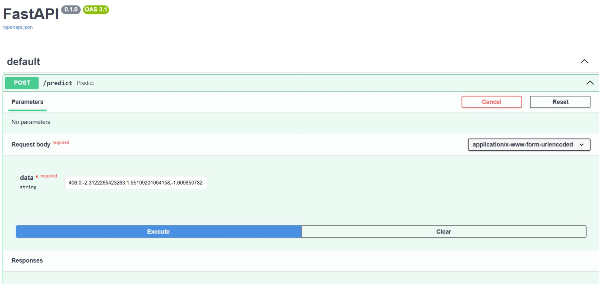
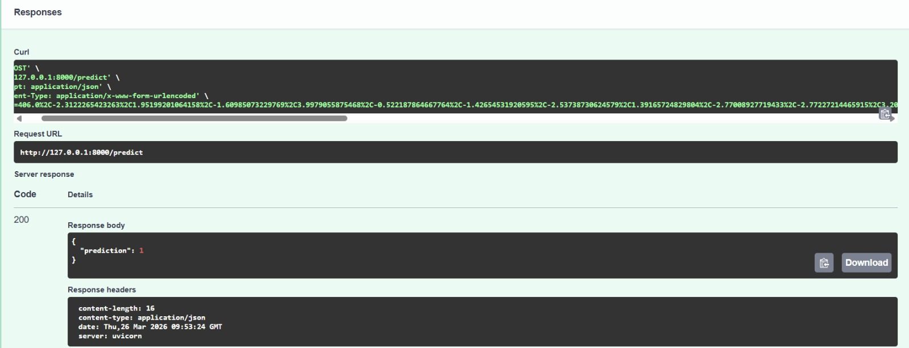

# Credit Card Fraud Detection

An end-to-end machine learning system to detect fraudulent
credit card transactions from a highly imbalanced dataset.

## Live Demo
[Click here to try the app](https://credit-card-fraud-detection-nh2nruv2xnenz8f6vhdjhn.streamlit.app)

## Problem Statement
Real-world fraud data is extremely imbalanced — only 492
fraud cases out of 284,807 transactions (0.17%).
Standard models fail on such data. This project solves
that using SMOTE oversampling.

## Model Performance (Random Forest)
| Metric | Score |
|---|---|
| Overall Accuracy | 99.88% |
| Fraud Recall | 88% |
| Fraud Precision | 60% |
| Fraud F1-Score | 71% |
| Macro Avg F1 | 86% |

High recall (88%) is critical in fraud detection —
missing a fraud is costlier than a false alarm.

## Class Imbalance Handling
| | Normal | Fraud |
|---|---|---|
| Before SMOTE | 227,451 | 394 |
| After SMOTE | 227,451 | 227,451 |

SMOTE (Synthetic Minority Oversampling Technique)
generated synthetic fraud samples to balance training data.

## Tech Stack
| Layer | Technology |
|---|---|
| ML Model | Random Forest (n_estimators=100, max_depth=12) |
| Oversampling | SMOTE |
| Backend | FastAPI |
| Frontend | Streamlit |
| Language | Python 3 |

## How to Run

### Backend
```bash
pip install -r requirements.txt
uvicorn app:app --reload
```

### Frontend
```bash
streamlit run streamlit_app.py
```

## Input and Output
- Input: 30 PCA-transformed transaction features
- Output: Fraud or Normal transaction label

## Screenshots
### UI

### API

### Prediction


## Author
Shiva | https://github.com/shiva-ml-dev
